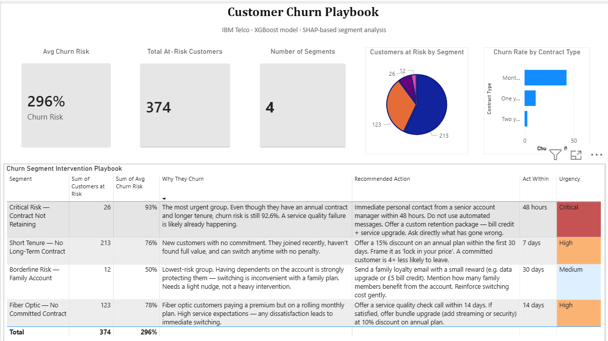

# Customer Churn Playbook
**26% of customers were predicted to churn — this project identifies WHO, WHY, and what to do.**

---

## What I Found

- **374 at-risk customers** identified from 1,409 test records
- **Cluster 0 (213 customers, 76% risk):** New customers with no long-term contract — highest volume segment
- **Cluster 2 (26 customers, 93% risk):** Most urgent — even an annual contract isn't retaining them
- Month-to-month contract customers churn at **42%** vs **3%** for two-year contract customers
- Customers with 0–12 months tenure churn at **3× the rate** of customers with 4+ years

## What I Built

A full churn prediction and intervention system:

1. **SQL (DuckDB)** — 5 exploratory queries to understand churn patterns before modelling
2. **XGBoost model** — trained with class imbalance correction (AUC: 0.87)
3. **SHAP explanations** — explains WHY each customer is at risk individually
4. **SHAP-based clustering** — groups churners by churn REASON, not demographics
5. **Power BI dashboard** — segment intervention playbook for business teams

## Tech Stack
Python · XGBoost · SHAP · DuckDB · scikit-learn · Power BI · pandas

## Data
IBM Telco Customer Churn — [download from Kaggle](https://www.kaggle.com/datasets/blastchar/telco-customer-churn)
